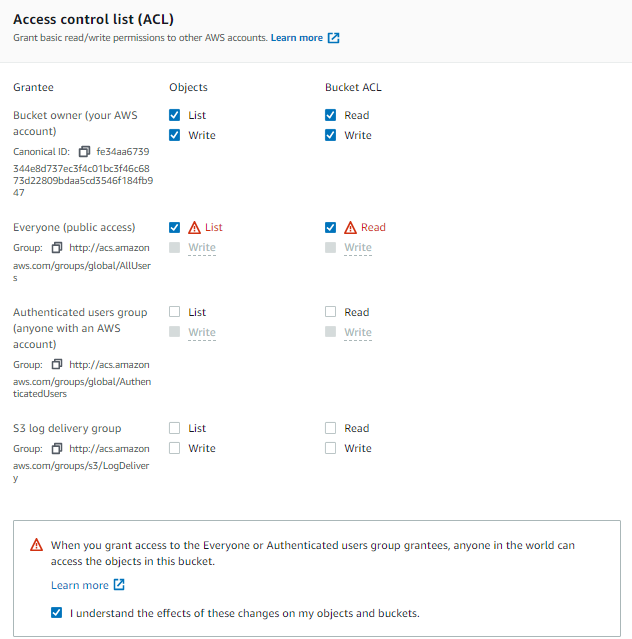
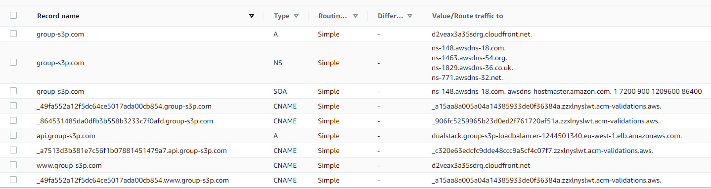

### Settings in `S3 bucket`:
First, before routing is possible, you need to check some settings in the S3 bucket.
1) You need to build webclient. Upload files and static folder
2) Choose `Grant public-read access` and check `I understand..`
3) We like to `enable versioning`, but is probably not relevant for routing
4) Enable `Static website hosting` and you <b>MUST</b> add file for `index document` and `error document`. We used index.html for both
5) Turn off `Block all public access`
6) `Access control list (ACL)` should have following: 

### Create SSL Certificate in `Certificate Manager`:
Very straight forward process. Request public certificate and <em>validate with DNS</em>.
You need to <b>create certificate in US region</b> if enabling edge locations
* group-s3p.com (main domain)
* Then `Add another name to this certificate` *.group-s3p.com (every subdomain should work. E.g. api.group-s3p.com, www.group-s3p.com)
* When finished will the validation have status pending. Go into further details and then click "Create record in Route 53". It will add CNAME with name and value

### Settings in `Cloudfront`:
Update following:
1) Add subdomain as `Alternate domain names`
2) `Custom SSL Certificate`
3) Set `Default Root Object` to index.html
4) `Origin Domain Name` needs static website hosting url from S3 bucket
5) Optional `Redirect from HTTP to HTTPS`

### Settings in `Routing 53`:

### Extra things to keep in mind:
- If you want to use `Alias` when creating new `record`, remember that bucket name must be equal to domain name 
  For example will <em>S3 bucket</em> <u>group-s3p.com</u> <b>match</b> <em>domain name</em> <u>group-s3p.com</u> 
  group-s3p.com will <u>not</u> match www.group-s3p.com  
   
- API receives GET-request by HTTP default. Therefore will you get trouble when frontend use HTTPS, and API uses HTTP. 
It will result in your frontend not being able to send and receive data from API (backend).
  You have at least two possibilities to solve this:
  - <b>Best option:</b> Create SSL certificate for API, configure routing, don't touch Cloudfront since this is regarding backend. 
    Next step will be to use EC2 Load Balancer. When stopping a cluster's service/task will private and public address be changed. Load Balancer solves this.
    
- The other is to change site settings where you tell the browser to accept insecure content
    
